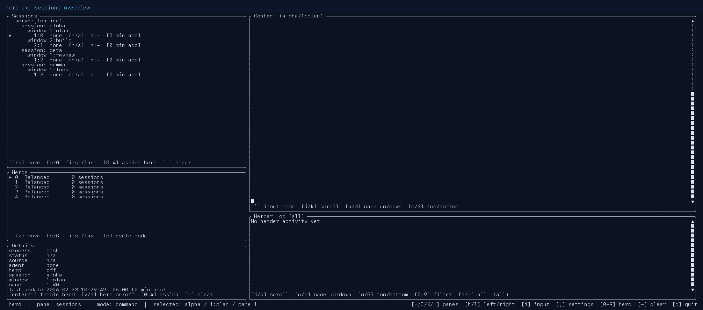

# herd

`herd` is a Rust CLI/TUI for monitoring and steering Codex/Claude agent sessions running in tmux.



## Documentation Index

- [Documentation Home](docs/README.md)
- [Quickstart](docs/quickstart.md)
- [CLI Reference](docs/cli.md)
- [TUI Guide and Keybindings](docs/tui.md)
- [Configuration](docs/configuration.md)
- [Herd Modes and Rule Engine](docs/rules.md)
- [Screenshots](docs/screenshots/README.md)
- [Docker Workflows](docs/docker.md)
- [Testing](docs/testing.md)

## High-Level Usage

Prerequisites:

- Rust toolchain (`cargo`)
- tmux
- Optional: `codex` and/or `claude` for agent-aware status behavior

Build:

```bash
cargo build
```

Run the TUI:

```bash
cargo run -- tui
```

List sessions and derived statuses:

```bash
cargo run -- sessions
```

Manage herd state:

```bash
cargo run -- herd list
cargo run -- herd mark %1
cargo run -- herd unmark %1
```

## Config and State Locations

By default, herd stores runtime data in your home config directory:

- `~/.config/herd/settings.json`
- `~/.config/herd/state.json`
- `~/.config/herd/herd_modes/*.json`

These files are created and normalized automatically as needed.

## Fast Path

1. Start or attach to tmux sessions where your agents are running.
2. Run `cargo run -- tui`.
3. Use `,` to open Settings and configure provider/model keys.
4. Mark sessions as herded and assign herd groups/modes.
5. Monitor content and the always-visible Herder Log.
