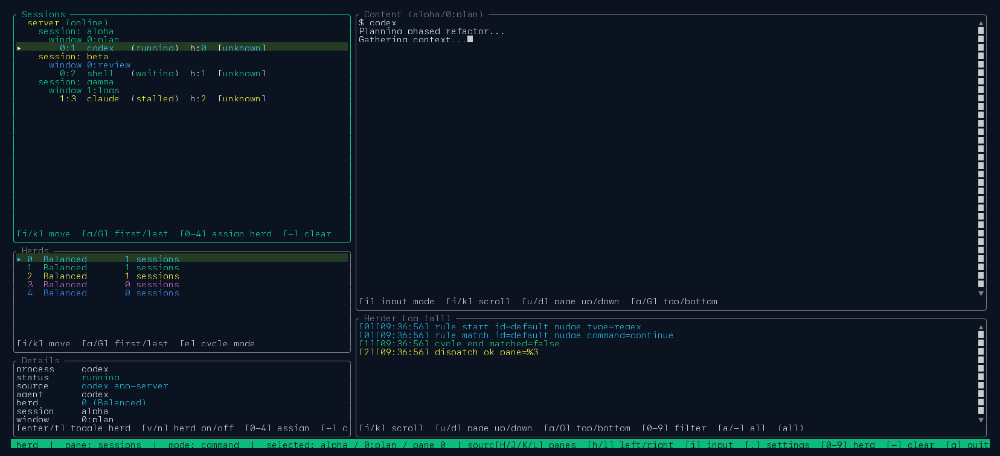
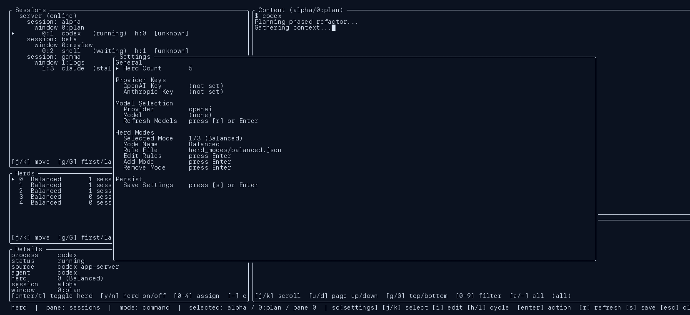
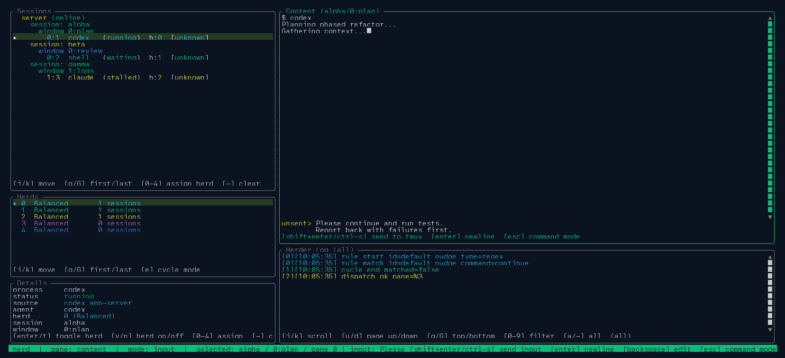
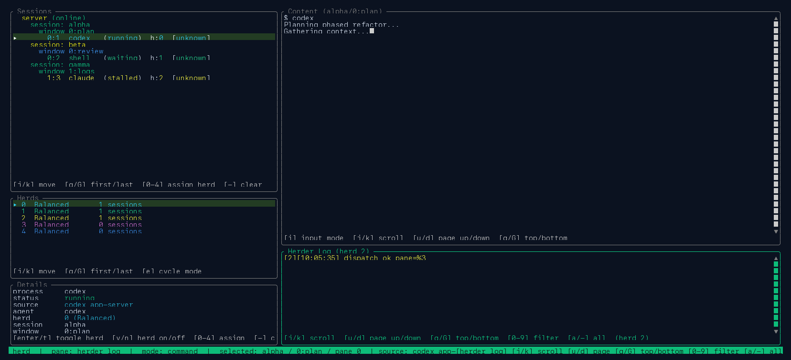

# Screenshots

These screenshots are generated from deterministic TUI render states during test runs.

To regenerate:

```bash
./scripts/capture-doc-screenshots.sh
```

Or during integration tests:

```bash
HERD_CAPTURE_DOC_SCREENSHOTS=1 ./scripts/run-integration-tests.sh --tier fast
```

## Gallery

### TUI Overview



### Settings Overlay



### Content Input Mode



### Herder Log Filter


